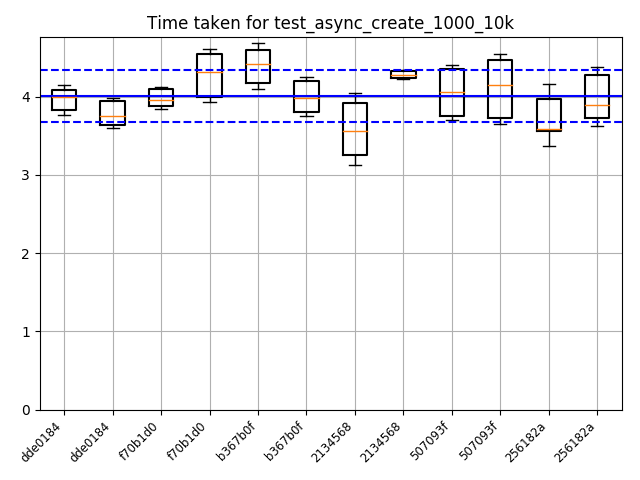

Benchmarks python graphs
========================

This page documents an example of how to query elasticsearch and plot the
results with python. We are currently using ``kibana`` to plot and show graphs,
but in the future we might want/need the flexibility of python for that.

Generated image
---------------

Code example
------------

Some notes about the code example:

* Depends on ``elasticsearch`` for querying and ``matplotlib`` for plotting.
* Searches need to be scrolled to get all results using a ``scroll_id``.
* Commit datetime ranges (`1 <https://www.elastic.co/guide/en/elasticsearch/reference/current/query-dsl-range-query.html>`_, `2 <https://www.elastic.co/guide/en/elasticsearch/reference/current/common-options.html#date-math>`_, `3 <https://www.elastic.co/guide/en/elasticsearch/reference/current/search-aggregations-bucket-daterange-aggregation.html#date-format-pattern>`_) can be put in place to limit results.

.. code:: python

    #!/usr/bin/env python

    import os

    from math import sqrt
    from dateutil.parser import parse

    from elasticsearch import Elasticsearch
    from elasticsearch.exceptions import NotFoundError

    import matplotlib.pyplot as plt

    def sort_commits(a, b):
        ta = parse(a['_source']['commit_info']['author_time'])
        tb = parse(b['_source']['commit_info']['author_time'])
        return -1 if ta < tb else 1

    def _query_elasticsearch():
        http_auth = os.environ.get('ES_CREDS').split(':')

        es = Elasticsearch([{
            'host': 'moose.leap.se',
            'port': 9200,
            'use_ssl': True,
            'http_auth': http_auth,
        }])

        q = "commit_info.project:soledad " \
            "AND machine_info.host='weasel' " \
            "AND name='test_async_create_1000_10k' " \
            "AND commit_info.time:[\"now-1d\" TO \"now\"]"

        res = es.search(index='benchmark', q=q, scroll='1m', size=50)

        total = res['hits']['total']
        scroll_size = total
        scroll_id = res['_scroll_id']
        hits = res['hits']['hits'][:]

        print("There are %d hits to get." % total)
        print("(got %d...)" % len(hits))

        # scroll to get all results
        print("(started scrolling...)")
        while scroll_size > 0:
            try:
                res = es.scroll(scroll_id=scroll_id, scroll='1m')
                scroll_size = len(res['hits']['hits'])
                scroll_id = res['_scroll_id']
                print("(got %d more...)" % scroll_size)
                hits += res['hits']['hits'][:]
            except NotFoundError:
                print("(finished scrolling.)")
                pass
                break

        print("Found %d hits." % len(hits))
        hits.sort(sort_commits)

        stats = []
        means = []

        for hit in hits:
            st = hit['_source']['stats']
            commit_id = hit['_source']['commit_info']['id'][:7]

            item = {}

            item["label"] = commit_id
            item["mean"] = st['mean']
            item["med"] = st['median']
            item["q1"] = st['q1']
            item["q3"] = st['q3']
            # item["cilo"] = 5.3 # not required
            # item["cihi"] = 5.7 # not required
            item["whislo"] = st['mean'] - st['stddev']
            item["whishi"] = st['mean'] + st['stddev']
            item["fliers"] = []  # required if showfliers=True

            stats.append(item)
            means.append(st['mean'])

            # print(hit['_source']['commit_info'])

        return stats, means

    def mean(lst):
        return sum(lst) / len(lst)

    def stddev(lst):
        mn = mean(lst)
        variance = sum([(e - mn)**2 for e in lst]) / len(lst)
        return sqrt(variance)

    def _plot_graph(results):
        print("Plotting graph...")
        stats, means = results
        fig, axes = plt.subplots(1, 1)
        plt.grid()
        axes.bxp(stats)

        mmean = mean(means)
        mstddev = stddev(means)
        plt.axhline(y=mmean + (1.5 * mstddev), color='b', linestyle='--')
        plt.axhline(y=mmean - (1.5 * mstddev), color='b', linestyle='--')
        plt.axhline(y=mmean, color='b', linestyle='-')

        axes.set_title('Time taken for test_async_create_1000_10k')

        plt.xticks(rotation=45, ha='right', size='small')
        plt.ylim(ymin=0)
        plt.tight_layout()

        # boxplot
        filename = '/tmp/test.png'
        print("Saving to %s" % filename)
        plt.savefig(filename)
        # plt.figure()
        # plt.show()

    if __name__ == '__main__':
        results = _query_elasticsearch()
        _plot_graph(results)
